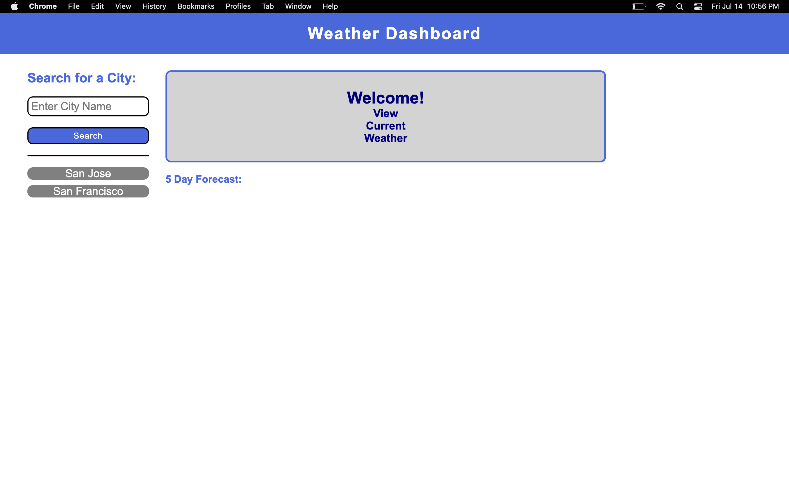
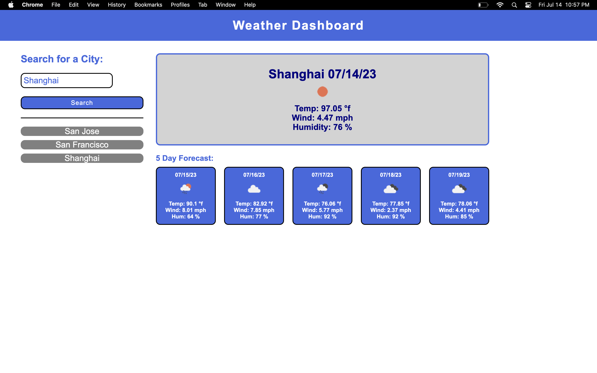

# Weather Dashboard

## Technology Used 

| Technology Used         | Resource URL           | 
| ------------- |:-------------:| 
| HTML    | [https://developer.mozilla.org/en-US/docs/Web/HTML](https://developer.mozilla.org/en-US/docs/Web/HTML) | 
| CSS     | [https://developer.mozilla.org/en-US/docs/Web/CSS](https://developer.mozilla.org/en-US/docs/Web/CSS)      |   
| Git | [https://git-scm.com/](https://git-scm.com/)     |  
| Javascript | [https://developer.mozilla.org/en-US/docs/Web/JavaScript](https://developer.mozilla.org/en-US/docs/Web/JavaScript) |
| DayJS | [https://day.js.org/docs/en/display/display](https://day.js.org/docs/en/display/display)
| JQuery | [https://api.jquery.com/category/attributes/](https://api.jquery.com/category/attributes/)  

## Description 

[Visit the Deployed Site](https://jesustgr.github.io/weather-dashboard/)

The goal of this site is for the user to see the weather outlook for multiple cities to do things such as plan a trip accordingly. This application a weather dashboard that runs in the browser and features dynamically updated HTML and CSS. I used the Open Weather Map APIto retrieve weather data for cities. I used local storage to store persistent data.

## Usage 

The screenshots below demonstrate the application's functionality.

This shows the initial layout of when the user opens the app. If the user used the app before, their search history is displayed below the search bar.

The user can type a city name into the search bar and click SEARCH. The current weather will appear in the top right and the 5 day forecast will appear below that. The city that the user searched for will be added to the search history.

## Learning Points 

This was my first time using server-side API's in a project.

## Author Info

### Jesus Thomas Reyes 

* [Portfolio](https://jesustgr.github.io/my-portfolio/)
* [LinkedIn](https://www.linkedin.com/in/jesus-thomas-reyes-aa001a192/)
* [Github](https://github.com/jesustgr)

